# 托管 5 个 LINE 官方账号：取密钥 + 公网部署（图文教程）

一台小 VPS 就能同时托管 5 个 LINE Official Account。每个账号一套独立密钥、一条独立 webhook 路径；服务端按路径分流、按账号验签、按账号回复。

配套代码在仓库根目录的 [`line-hub/`](../../line-hub/)。

> 截图分两类：带红框的是 [LINE 官方文档](https://developers.line.biz/) 原图加中文标注；Channel secret / Access token 那两页官方没公开完整截图，按控制台真实字段画了示意图。来源清单见 [SOURCES.md](SOURCES.md)。

---

## 你最终会拿到什么

每个账号 3 样东西，5 个账号一共 15 个值：

| 名称 | 在哪一页 | 干什么 | 对应 `.env` |
|---|---|---|---|
| Channel ID | Basic settings | 对账、排错 | 记在本子上即可 |
| **Channel secret** | Basic settings | 校验 webhook 签名 | `ACCn_CHANNEL_SECRET` |
| **Channel access token** | Messaging API | 调用 API 发消息 | `ACCn_CHANNEL_TOKEN` |

填完之后长这样：

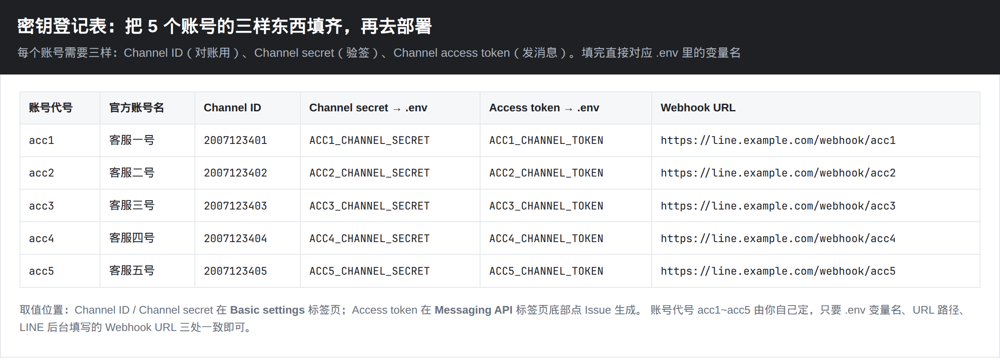

---

## 0. 先看懂整体架构

用户在手机 LINE 里给某个官方账号发消息 → LINE 平台按该 channel 配置的 Webhook URL 把事件 POST 到你的服务器 → 你的服务用**这个账号自己的** secret 验签 → 立刻回 200 → 后台用**这个账号自己的** token 调 reply API。

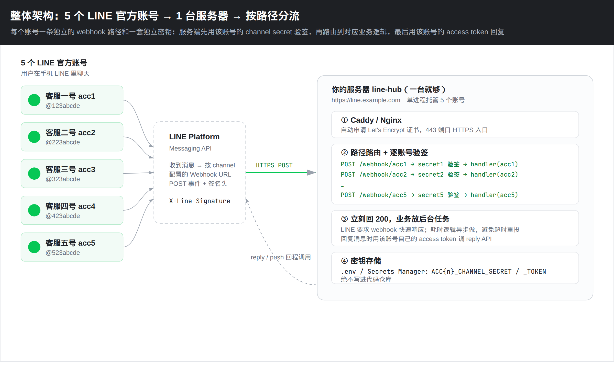

为什么要 5 条路径、不能共用一个 webhook？

- LINE 每个 channel **只能填一个** webhook URL。
- 签名用的 secret **每个 channel 不同**。共用一个入口就不知道该用哪把钥匙验签。
- 回消息用的 token 也不同。路径即账号，最不容易搞混。

---

## 1. 在 Official Account Manager 建好 5 个账号

打开 [https://manager.line.biz/](https://manager.line.biz/)。没有 Business ID 先按 [官方入门](https://developers.line.biz/en/docs/messaging-api/getting-started/) 注册一个。

一个登录账号可以管多个官方账号，5 个号建在同一个 Business ID 下最省事。

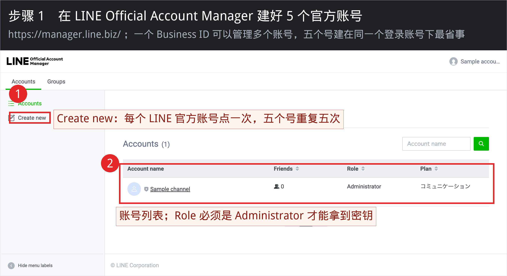

要点：

1. 左侧点 **Create new**，每个号点一次，重复 5 次。
2. 列表里你的 **Role 必须是 Administrator**，否则 Developers Console 里看不到 secret / token。
3. 账号名称建议写成「客服一号 / 客服二号…」，后面填表不容易对错号。

---

## 2. 给每个账号启用 Messaging API

路径：选中某个账号 → 右上角 **設定 / Settings** → **Messaging API** → **Enable**。

启用后才会在 LINE Developers Console 生成同名 channel。**5 个账号各点一次。**

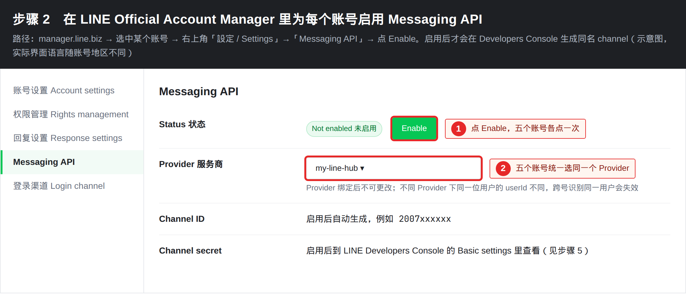

两个坑：

- **Provider 一旦绑定就不能换。** 5 个号建议挂同一个 Provider，方便统一管理。
- 不同 Provider 下，同一位 LINE 用户的 `userId` **不一样**。以后想跨号识别同一用户会失效。

如果登录账号从没进过 Developers Console，会先让你填开发者姓名和邮箱，填完即可。

---

## 3. 建立 / 选择 Provider

打开 [https://developers.line.biz/console/](https://developers.line.biz/console/)。没有 Provider 就新建一个，例如 `my-line-hub`。

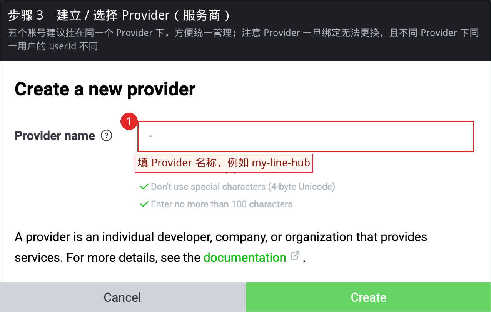

---

## 4. 打开对应的 Messaging API channel

启用 Messaging API 之后，每个官方账号会在这个 Provider 下出现一张卡片。点进去。

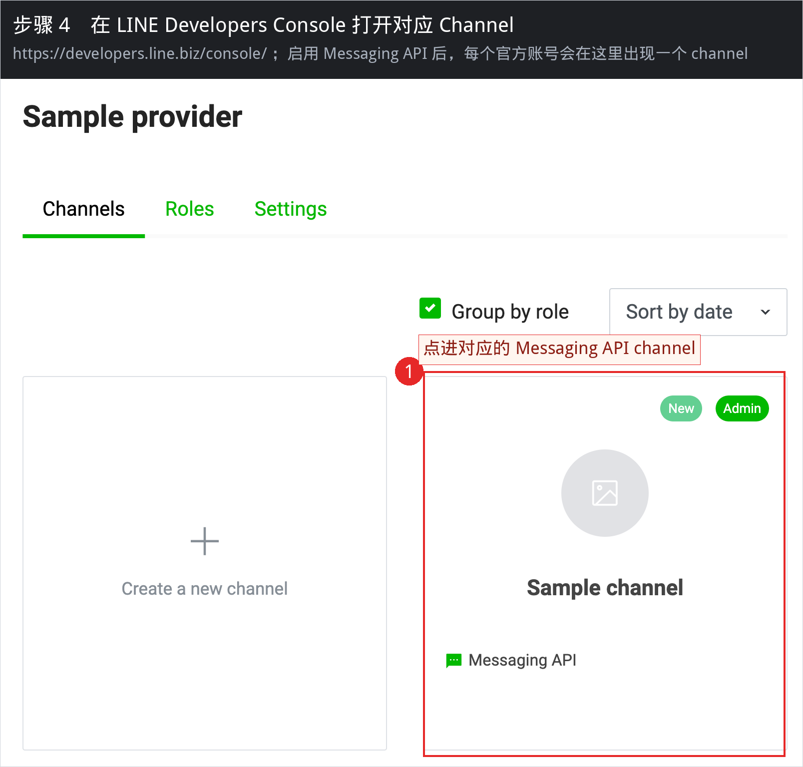

5 个账号就是 5 张卡片，后面第 5～8 步对每张卡片各做一遍。

---

## 5. 复制 Channel secret（验签用）

进 channel 后先打开 **Basic settings** 标签页。

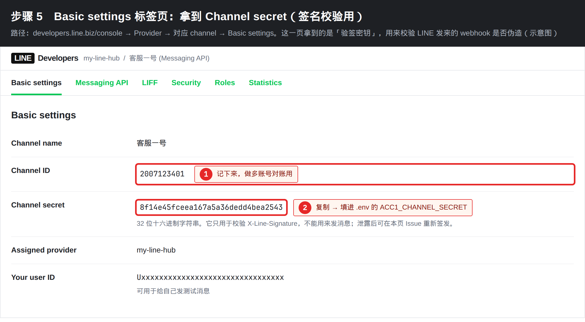

- **Channel ID**：一串数字，记下来对账用。
- **Channel secret**：32 位十六进制。复制到 `.env` 的 `ACC1_CHANNEL_SECRET`（二号就 `ACC2_…`）。
- secret **不能用来发消息**，只用来校验 `X-Line-Signature`。怀疑泄露了就在本页重新 Issue。

---

## 6. 签发 Channel access token（发消息用）

切到 **Messaging API** 标签页，拉到 **Channel access token (long-lived)**。

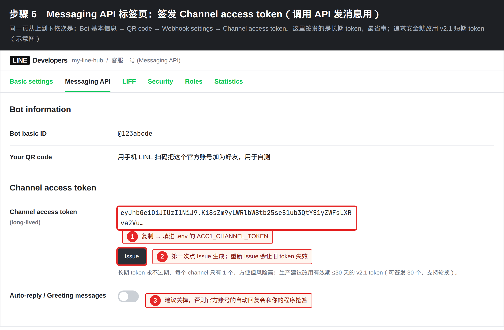

- 第一次点 **Issue** 生成，复制到 `.env` 的 `ACC1_CHANNEL_TOKEN`。
- **重新 Issue 会让旧 token 立刻失效**，正在跑的服务会发不出消息。
- 长期 token 永不过期、每个 channel 只有 1 个，图省事可以先用这个。上线后建议换成有效期 ≤30 天的 [v2.1 token](https://developers.line.biz/en/docs/basics/channel-access-token/)，支持轮换。
- 同一页把 **Greeting messages** 和 **Auto-reply messages** 关掉。不关的话，官方账号自带的自动回复会和你的程序抢答，排查时分不清是谁回的。

用手机 LINE 扫本页的 QR code，把这个官方账号加为好友，后面自测要用。

---

## 7. 填 Webhook URL（先不要 Verify）

还在 **Messaging API** 标签页，找到 **Webhook settings**。这一步要等服务器起来再 Verify，但 URL 规则现在就要定好：

| 账号 | Webhook URL |
|---|---|
| acc1 | `https://你的域名/webhook/acc1` |
| acc2 | `https://你的域名/webhook/acc2` |
| acc3 | `https://你的域名/webhook/acc3` |
| acc4 | `https://你的域名/webhook/acc4` |
| acc5 | `https://你的域名/webhook/acc5` |

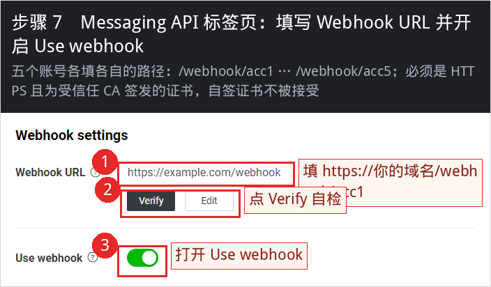

硬性要求（官方原文）：

- 必须是 **HTTPS**。
- 证书必须由浏览器普遍信任的 CA 签发。**自签证书一律不接受。**
- 每个 channel 只能填一个 webhook URL。

先点 **Edit** 填上 URL 并 **Update**。**Use webhook** 先打开。**Verify** 等第 11 步服务器起来再点。

建议同时打开失败重投：

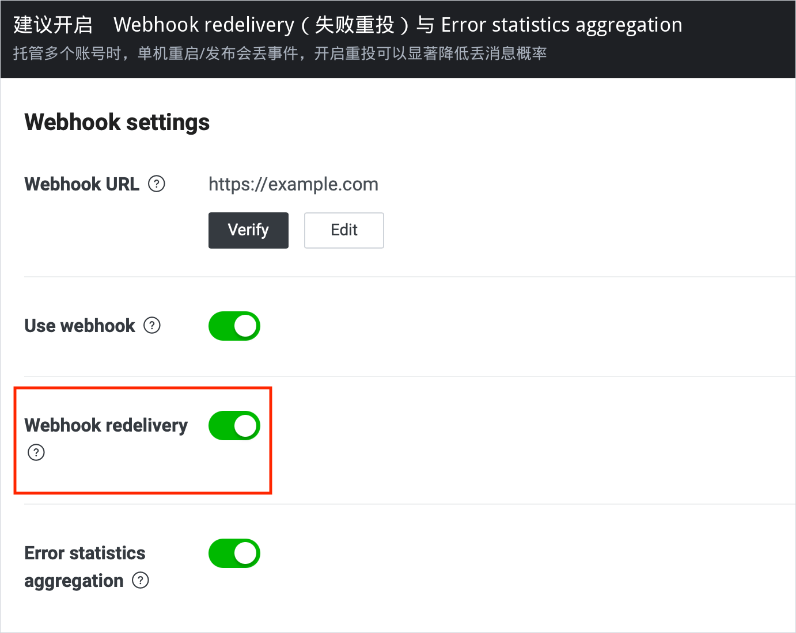

发布、重启那几秒丢的事件会被重投，5 个号一起托管时特别有用。

---

## 8. 本地先跑通（可选，但强烈建议）

本机没有公网 HTTPS，LINE 的 Verify 会失败。本地只做两件事：确认程序能起来、确认验签不是摆设。

```bash
cd line-hub
python3 -m pip install -r app/requirements.txt
cp .env.example .env
# 把 5 套 SECRET / TOKEN 填进 .env
python3 -m uvicorn app.main:app --host 127.0.0.1 --port 8000
```

另开一个终端：

```bash
curl -s http://127.0.0.1:8000/healthz
# 期望: {"ok":true,"accounts":["acc1","acc2","acc3","acc4","acc5"]}
```

用配套测试验证「错 secret 必须 403」：

```bash
cd line-hub
python3 -m pip install -r app/requirements.txt pytest
python3 -m pytest tests/test_signature.py -q
```

想用真实 LINE 事件打本地，可以用 [ngrok](https://ngrok.com/) 临时开一条 HTTPS 隧道（免费域名也是受信任证书）：

```bash
ngrok http 8000
# 得到 https://xxxx.ngrok-free.app
# 把 5 个 channel 的 Webhook URL 临时改成
# https://xxxx.ngrok-free.app/webhook/acc1  … acc5
# 然后点 Verify
```

ngrok 免费域名会变，只适合联调。正式环境用自己的域名。

---

## 9. 买一台能被公网访问的服务器

最低配置：1 核 1G、Ubuntu 22.04 / 24.04、每月流量 1TB 足够。节点优先选 **日本或新加坡**，离 LINE 平台近。

安全组 / 防火墙放行：

| 端口 | 用途 |
|---|---|
| 80 | Let's Encrypt HTTP-01 验证，Caddy 必须能拿到 |
| 443 | 正式 HTTPS webhook |
| 22 | SSH，建议改成密钥登录并限制来源 IP |

再准备一个域名，加一条 A 记录指到服务器公网 IP：

```
line.example.com.    A    1.2.3.4
```

用 `dig +short line.example.com` 确认已经解析到这台机器，再往下走。证书申请依赖这步。

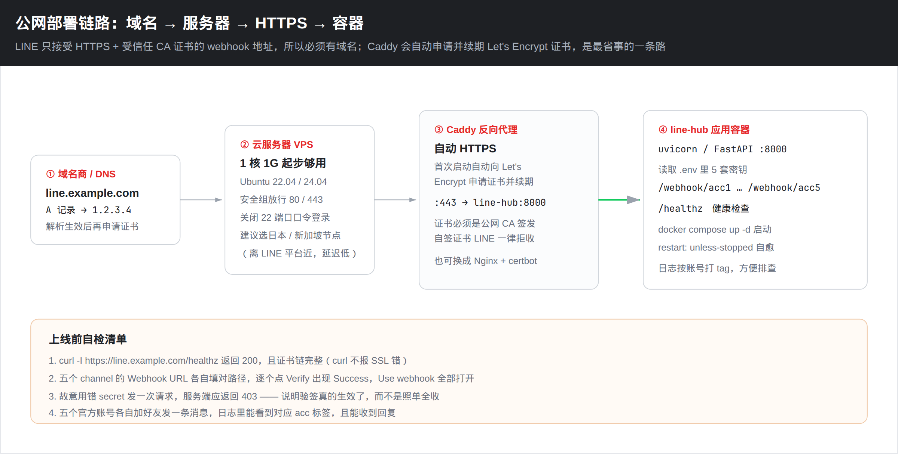

---

## 10. 在服务器上部署

SSH 登录后：

```bash
sudo apt-get update
sudo apt-get install -y git docker.io docker-compose-v2
sudo usermod -aG docker "$USER"
# 重新登录一次让 docker 组生效
```

把本仓库拷上去（或只拷 `line-hub/` 目录）：

```bash
git clone <你的仓库地址> && cd <仓库>/line-hub
cp .env.example .env
nano .env
```

`.env` 里至少改这些：

```dotenv
LINE_DOMAIN=line.example.com

ACC1_NAME=客服一号
ACC1_CHANNEL_SECRET=从 Basic settings 复制
ACC1_CHANNEL_TOKEN=从 Messaging API 页 Issue 后复制

ACC2_NAME=客服二号
ACC2_CHANNEL_SECRET=...
ACC2_CHANNEL_TOKEN=...
# acc3 ~ acc5 同样
```

启动：

```bash
docker compose up -d --build
docker compose logs -f --tail=80
```

看到 `loaded accounts: acc1, acc2, acc3, acc4, acc5` 和 Caddy 申请证书成功，就算起来了。

自检：

```bash
curl -I https://line.example.com/healthz
# 期望 HTTP/2 200，且 curl 不报 SSL 错误
```

证书链不完整时，LINE 的 Verify 会失败，即使浏览器偶尔能打开。`curl` 报错就先别去点 Verify。

---

## 11. 回到 Console 点 Verify

服务器起来之后，5 个 channel 逐个打开 **Messaging API** 标签页：

1. Webhook URL 确认是 `https://你的域名/webhook/accN`（N 和账号对得上）。
2. 点 **Verify**，出现 **Success**。
3. **Use webhook** 保持打开。

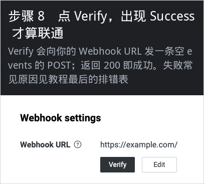

Verify 其实是 LINE 向你的 URL 发一条 `{"events":[]}` 的 POST，带签名。本仓库的服务对空 events 也会验签并回 200，所以 Verify 能过。

然后用手机给 5 个官方账号各发一句「ping」，应该各自回 `[客服N号] ping`。服务器日志里能看到对应的 `slug=accN`。

---

## 12. 可选加固

使用长期 token 时，可以在 channel 的 **Security** 标签页把服务器出口 IP 加进白名单。token 就算泄露，别人的机器也调不了 API。

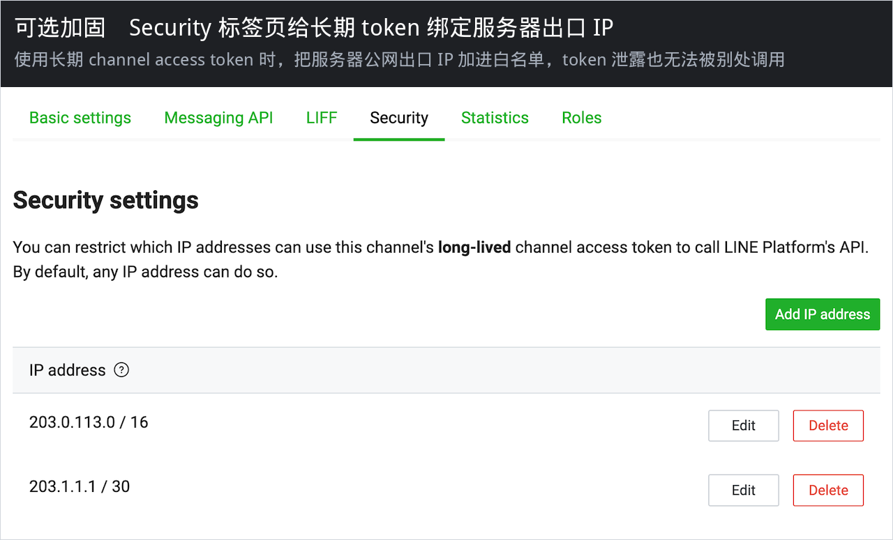

生产环境更稳妥的做法：

- 不要把 `.env` 提交进 git（仓库已忽略）。
- 长期 token 换成 v2.1 短期 token，到期自动轮换。
- 服务器禁掉密码 SSH，只留密钥。
- 日志里不要打印 token / secret。

---

## 排错

| 现象 | 原因 | 处理 |
|---|---|---|
| Verify 报 SSL / certificate | 自签证书、证书链不完整、域名没解析到这台机器 | `curl -vI https://域名/healthz` 看证书；等 DNS 生效后再让 Caddy 重签 |
| Verify 报 404 | URL 路径写错，或服务没起来 | 必须是 `/webhook/acc1` 这种，末尾不要多斜杠；`docker compose ps` 看健康检查 |
| Verify 报 403 | 填进 `.env` 的 secret 和这个 channel 对不上 | 重新从 Basic settings 复制，注意 acc1 的 secret 不要贴到 acc2 |
| Verify 超时 | 安全组没放 443，或 webhook 处理太慢 | 放行 80/443；本服务是先回 200 再处理后台任务，一般不会超时 |
| 能 Verify 但收不到用户消息 | **Use webhook** 没打开 | 回到 Messaging API 页把开关打开 |
| 用户有回复但不是你的程序回的 | Greeting / Auto-reply 还开着 | 在 OA Manager 或 Messaging API 页关掉 |
| 发不出消息，API 401 | token 重新 Issue 过，旧的失效了 | 把新 token 写进 `.env`，`docker compose up -d` 重启 |
| 只有某几个号不通 | 5 个 URL / 5 套密钥对串了 | 对照第 0 节的登记表，三个地方（Console、`.env`、路径）必须一致 |
| 本地 pytest 失败 | 依赖没装 | `pip install -r app/requirements.txt pytest` |

官方自检步骤还可以参考：[Verify that webhook works](https://developers.line.biz/en/docs/messaging-api/building-bot/#verify-that-webhook-works)——把官方账号拉黑会触发 `unfollow` 事件，日志里能看到就说明 webhook 真的通了，测完记得解除拉黑。

---

## 目录对照

```
line-hub/
  app/main.py          # FastAPI：/webhook/{acc1..acc5} + 验签 + 回声
  app/signature.py     # HMAC-SHA256 验签
  app/config.py        # 从 ACC1_…ACC5_ 环境变量加载账号
  app/line_api.py      # reply / push
  Dockerfile
  docker-compose.yml   # line-hub + Caddy 自动 HTTPS
  Caddyfile
  .env.example
  tests/test_signature.py
docs/line-multi-account/
  README.md            # 本教程
  images/              # 配图
  tools/               # 重新生成配图的脚本
```

改业务逻辑只动 `app/main.py` 里的 `handle_events`。5 个账号可以回不同的话术，看 `acc.slug` 分支即可。
