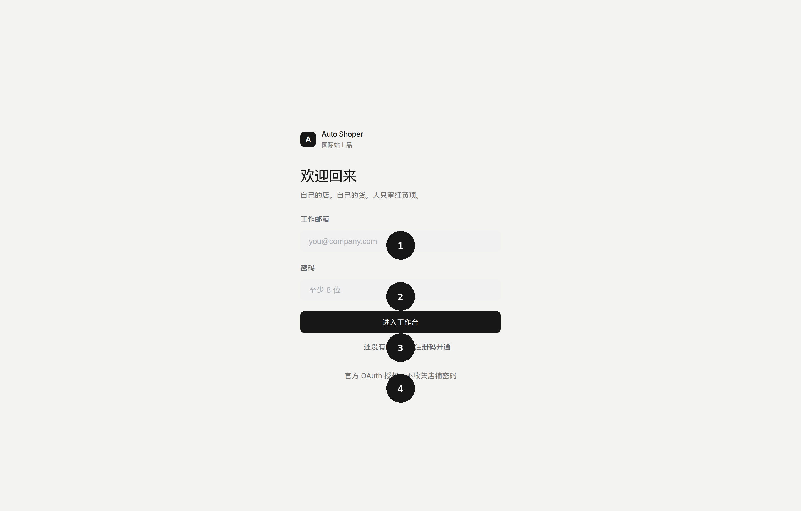
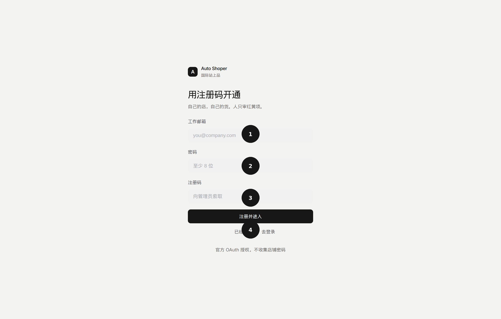
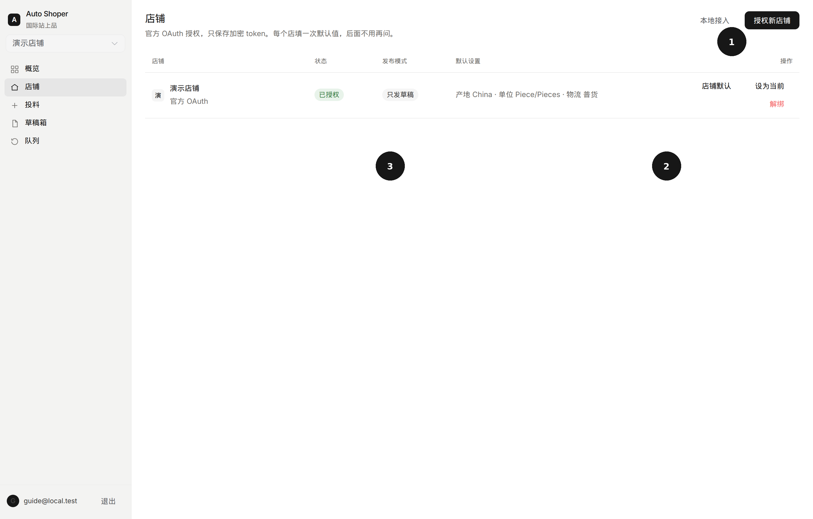
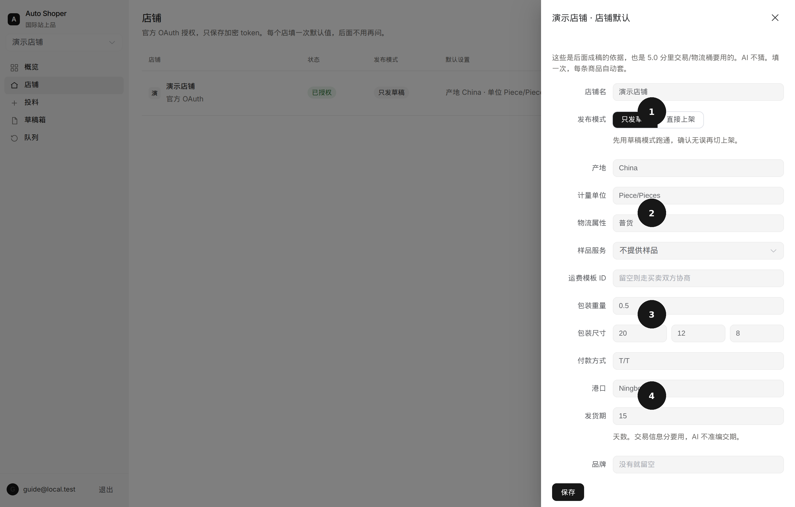
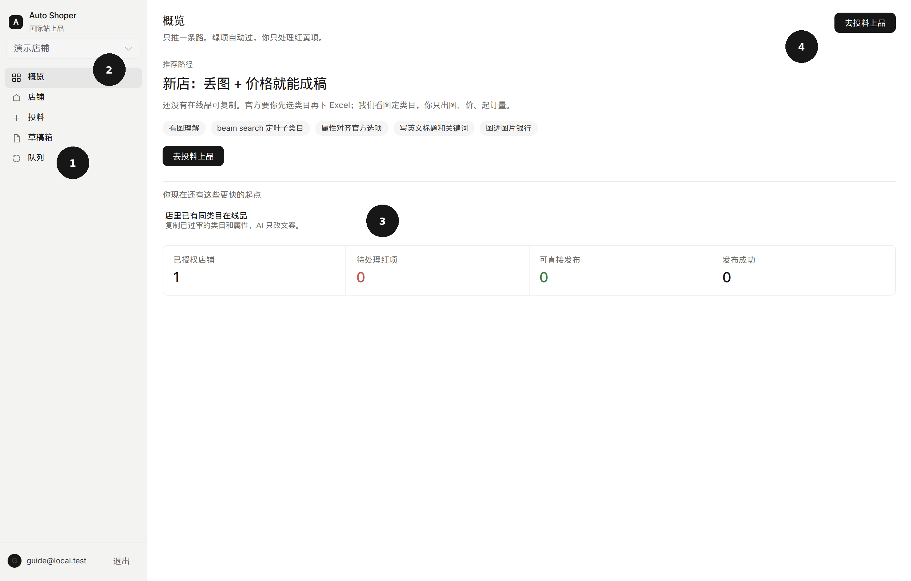
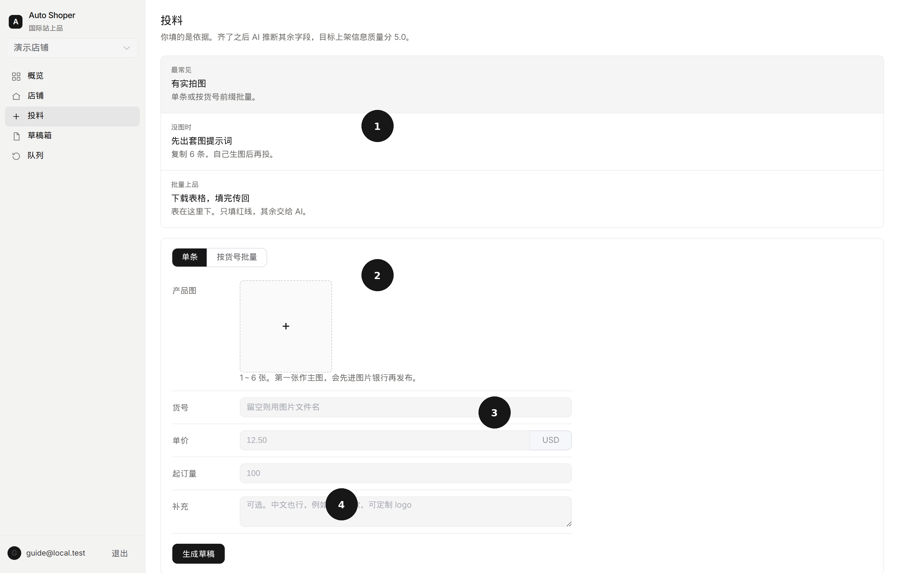
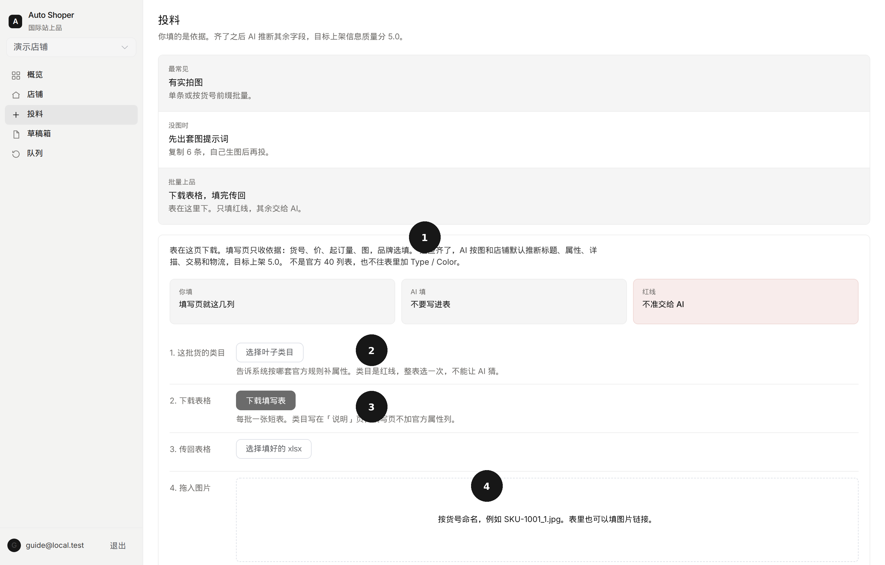
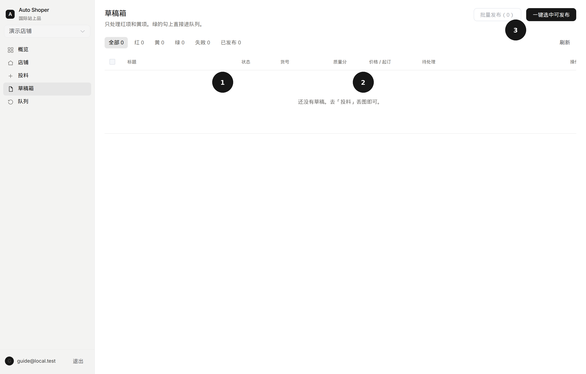
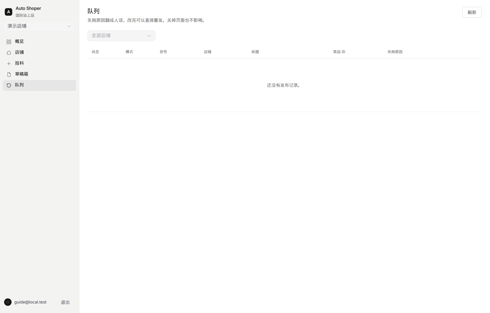

# Auto Shoper 使用说明

带批注的网页版：[guide/index.html](guide/index.html)（推到 GitHub 后可公网打开）。

跟着图上的黑圈数字点就行。人只出**依据**，其余字段交给 AI，目标上架信息质量分 **5.0**。

侧栏永远只有 5 项：概览 → 店铺 → 投料 → 草稿箱 → 队列。不要去阿里后台填 40 个红星字段。

```text
开通账号 → 授权自己的店 → 填一次店铺默认
        → 投料（实拍图 / 短表 / 没图生成套图）
        → 草稿箱核对 AI 填的，审过了才能发
        → 队列发布（失败原因是人话，改完重发）
```

---

## 0. 开通账号

打开工作台后先登录。没有账号就用管理员给的**注册码**开通。

### 已有账号



| 圈 | 点哪里 | 做什么 |
|---|---|---|
| 1 | 工作邮箱 | 填你的工作邮箱 |
| 2 | 密码 | 至少 8 位 |
| — | 进入工作台 | 黑按钮，进侧栏 |
| 3 | 还没有账号？ | 切到注册 |
| 4 | 底部说明 | 店铺用官方 OAuth，**不收集阿里密码** |

### 第一次开通



| 圈 | 点哪里 | 做什么 |
|---|---|---|
| 1 | 工作邮箱 | 以后登录用这个 |
| 2 | 密码 | 至少 8 位 |
| 3 | 注册码 | 向管理员索取，填错进不去 |
| 4 | 已经有账号 | 回到登录 |

开通后如果还没有店，会先落到「店铺」页。

---

## 1. 授权自己的店铺

国际站上品必须用**你自己店**的 token。平台只拿 AppKey，店和店之间隔离。



| 圈 | 点哪里 | 做什么 |
|---|---|---|
| 1 | 授权新店铺 | 跳转阿里官方页确认，回来就是「已授权」 |
| 2 | 店铺默认 | 填一次产地、包装、付款，后面每条货自动套 |
| 3 | 已授权 | 绿标表示 token 可用。异常就重新授权 |

本地调试可以用「本地接入」，把环境里的 token 绑成一个店，跳过 OAuth。正式环境请走官方授权。

左上角店铺下拉可以切换当前店。投料、草稿、队列都只看当前店。

---

## 2. 填一次店铺默认（5.0 的依据）

这些是经营决策，**AI 不准猜**。填一次，后面每条商品自动套，也是信息质量分里「交易 / 物流」两桶的来源。



| 圈 | 填什么 | 为什么 |
|---|---|---|
| 1 | 发布模式 | 先「只发草稿」跑通，确认后再切「直接上架」 |
| 2 | 产地、计量单位、物流、样品 | 官方红星。产地不要让 AI 改 |
| 3 | 运费模板、包装重量和尺寸 | 缺了物流分到不了 5.0。没有运费模板就留空，走买卖双方协商 |
| 4 | 付款、港口、发货期（天数）、品牌 | 付款/港口/交期不准编。没有品牌就留空 = 无品牌 |

保存后回投料。包装和交期没填时，草稿会标黄，提示补默认后再成稿。

---

## 3. 概览：只推一条路

登录后日常从「概览」进。它按你现在的情况只推**一个**按钮，不要自己选流程。



| 圈 | 是什么 | 怎么用 |
|---|---|---|
| 1 | 五步导航 | 日常只走这 5 个，不要找商品库 |
| 2 | 当前店铺 | 先选对店再投料 |
| 3 | 更快的起点 / 数字 | 有红项先审；有可发布的去草稿箱；老店可复制在线品 |
| 4 | 去投料上品 | 新店最常见：丢图 + 价格就能成稿 |

底下几个数：已登录店铺、待核对、待处理红项、已审可发、发布成功。有待核对或红项时，先去商品里看。

---

## 4. 投料：你填依据，AI 补其余

投料页有三条路，点顶部卡片切换。

### 4.1 有实拍图（最常见）



| 圈 | 点哪里 | 做什么 |
|---|---|---|
| 1 | 三条路 | 有图走这条；没图平台生成套图；批量走短表 |
| 2 | 产品图 | 1～6 张实拍。第一张是主图，会先入图片银行。至少 3 张才容易到 5.0 |
| 3 | 货号 | 可留空，默认用文件名。右侧填**单价 USD** 和**起订量**（红线，AI 不定价） |
| 4 | 补充 | 可选。中文也行，例如「加厚款，可定制 logo」 |

点「生成草稿」。要一次投很多货：切到「按货号批量」，图片按 `SKU-1001_1.jpg`、`SKU-1001_2.jpg` 命名，统一填一个价和一个起订量。

### 4.2 下载表格，填完传回（批量）

表在**这一页**下载，不是阿里后台那张 40 列表。填写页不加 Type / Color。



| 圈 | 点哪里 | 做什么 |
|---|---|---|
| 1 | 你填 / AI 填 / 红线 | 先看清谁写什么。粉的是红线，不准给 AI |
| 2 | 选择叶子类目 | 整表选一次。类目是红线，猜错发不出去、属性全废 |
| 3 | 下载填写表 | 短表：货号、单价、起订量、图片、品牌（选填）。类目写在「说明」页 |
| 4 | 拖入图片 | 按货号命名，或在表里填图片链接。然后点「批量成稿」 |

领星 / 店小秘 / 马帮 / 官方类目表在页面最下面「已有现成表」里，不是默认路径。

### 4.3 没实拍：平台生成套图

写出品名，平台按国际站 6 个坑位画套图，再填价格就能成稿。生成图会标黄，不能冒充实拍。

1. 可选类目模板（文具、五金、电子……不选则按品名匹配）
2. 写品名，补充材质、色号、装箱数等**能看见的事实**
3. 点「生成套图」：白底主图、尺寸、细节、场景、外箱、OEM
4. 填单价和起订量，生成草稿

---

## 5. 草稿箱：核对 AI 填的，看 5.0

成稿后到商品页。AI 会填错类目和规格，绿的也要打开看一眼。没点「审过了」不能进队列。



| 圈 | 点哪里 | 做什么 |
|---|---|---|
| 1 | 待审 / 待改 / 已审可发 | 待审=还没人看。待改=红项。已审可发=人看过且没有红项 |
| 2 | 质量分 | 按官方六桶预估：类目、基本信息、交易、物流、服务、详情。5.0 才算齐 |
| 3 | 一键选中已审可发 / 批量发布 | 只能勾已经点过「审过了」的 |

点「核对」进入一条：

- 红项：在官方选项里点一下（不要选 Other）
- 改 AI 填错的标题、关键词、规格
- 核单价和起订量
- 点「审过了，可以发」
- 标题、关键词可以改；手改过的，重新成稿不会覆盖
- 预估分不到 5.0 时，按黄条提示去补店铺默认或再补实拍，然后重成稿

视频和证书不能从实拍推断，系统不会编。上架后以阿里后台的 `productQuality` 为准。

---

## 6. 队列：失败是人话，改完重发



关掉页面不影响后台发布。

- **状态**：排队 / 进行中 / 成功 / 失败
- **模式**：官方草稿 或 直接上架（看店铺默认里怎么设）
- **失败原因**：官方错误码已翻成中文，并告诉你下一步
- 失败后点「看草稿」改，再「重发」

官方建议先用不超过 15 条测试，再大批量。

---

## 你填什么，AI 填什么

| 谁 | 字段 | 说明 |
|---|---|---|
| 你，每条货 | 实拍图、单价、起订量 | 依据。没有图无法识别，也无法发品 |
| 你，建议 | 货号、中文备注 | 备注给 AI 当提示，不进官方标题 |
| 你，选填 | 品牌 | 空着 = 无品牌。AI 不准编品牌名 |
| 你，整表一次 | 叶子类目（短表） | 红线。单条投料可由 AI 看图定类目，没把握会标黄 |
| 你，每个店一次 | 产地、单位、付款、港口、交期、运费、包装、样品 | 红线。5.0 的交易/物流桶靠它们 |
| AI | 英文标题、关键词、类目属性、详描、FAQ | 按图和官方选项。不选 Other，不编认证 |
| 系统 | 图片银行、schema 校验、重铺预检 | 外链图发不了，必须先入你店的图片银行 |

### 红线（给了 AI 会出问题）

- **售价、起订量** — 生意决策，不准定价
- **实拍图** — 不准用生成图冒充实拍
- **品牌** — 空着=无品牌，不准编
- **叶子类目** — 猜错发不出去，属性全废
- **原产地、证书 / CE / FDA、运费、付款、港口** — 店铺默认或你自己填

---

## 怎样才到 5.0

本地按官方六桶预估，草稿箱「质量分」列就是这个数。

要齐：

1. 叶子类目正确  
2. 标题 + 3 个关键词 + 必填属性都对上官方选项  
3. 价、起订量、单位、付款、交期  
4. 运费（或协商）、物流属性、包装重量和尺寸  
5. 样品策略  
6. 至少 3 张已入图片银行的实拍 + 详描  

缺包装、付款、交期，或只有 1 张图：质量分到不了 5.0，草稿标黄，不会假装满分。

---

## 常见问题

**授权跳回去报 Redirect uri does not match**  
开放平台里登记的回调，必须和本服务的 `/api/v1/alibaba/oauth/callback` 完全一致。

**投料提示先授权店铺**  
左上角先选一个「已授权」的店。

**成稿后属性是红的**  
点审稿，在下拉里选官方选项，不要选 Other。类目如果选错，先换类目再填属性。

**质量分不是 5.0**  
先看黄条缺哪一桶。包装和交期回店铺默认补；图不够就再投实拍，不要用生成图凑数。

**可不可以下载官方 40 列表来填**  
可以，在投料页最下面「已有现成表」。默认请用我们的短表，只填红线。

**没图怎么办**  
投料 → 平台生成套图 → 填价格 → 生成草稿。生成图不是实拍，买家问实拍时再补。
